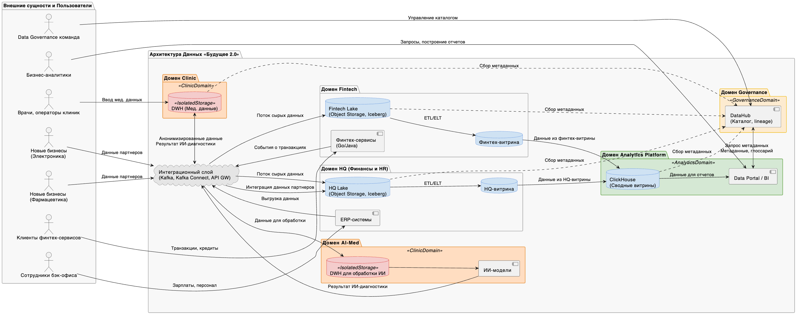

## 1. Предлагаемое разделение на домены

| Домен                                 | Назначение                                  | Ответственность          | Хранилище / Витрины                   | Комментарии                                             |
| ------------------------------------- | ------------------------------------------- | ------------------------ | ------------------------------------- | ------------------------------------------------------- |
| **Клинический (Clinic)**              | Медицинская карта, исследования, назначения | Клиники                  | DWH (изолировано)                     | Не участвует в BI, хранит чувствительные данные         |
| **ИИ-медицина (AI-Med)**              | Обработка снимков, ИИ-диагностика           | AI-команда               | DWH (изолировано)                     | Отдаёт результат обратно в DWH; не участвует в витринах |
| **Финтех (Fintech)**                  | Транзакции, кредиты, счета                  | Финтех-команда           | Object Storage → Iceberg → Data Marts | События публикуются в Kafka                             |
| **Финансы и HR (HQ)**                 | ERP, зарплаты, инвентарь, персонал          | Бэк-офис                 | Object Storage → Iceberg → Data Marts | Отдельные BI-витрины                                    |
| **Аналитика (Analytics Platform)**    | Витрина данных, BI, DataHub                 | Центр компетенций данных | ClickHouse, Data Portal, DataHub      | Объединяет доступ к витринам, без доступа к медданным   |
| **Интеграция (Integration Layer)**    | Kafka, API Gateway, Kafka Connect                 | Архитектура и платформа  | Kafka, Kafka Connect                        | Транспорт данных между доменами, без логики             |
| **Каталог и управление (Governance)** | Каталог, lineage, доступы                   | Data Governance команда  | DataHub                               | Сквозная прозрачность по всем доступным данным          |

## 2. DFD

Разделение системы «Будущее 2.0» на независимые домены — это шаг от централизованной и перегруженной архитектуры (монолитный DWH) к гибкой, масштабируемой и управляемой архитектуре, основанной на принципах Domain-Driven Design (DDD) и Data Mesh.

### Логика предлагаемого разделения

| Принцип                                                 | Как реализуется                                                                                                 |
| ------------------------------------------------------- | --------------------------------------------------------------------------------------------------------------- |
| **Бизнес-домены отражают структуру компании**           | Каждое подразделение (клиники, финтех, ИИ, головной офис) становится отдельным владельцем своих данных и логики |
| **Каждый домен — самостоятельный поставщик данных**     | Домен сам создаёт витрины, публикует события, управляет качеством и доступом к данным                           |
| **Изоляция чувствительных данных**                      | Медицинские данные полностью отделены от аналитической платформы (DWH остаётся внутри меддомена)                |
| **Транспорт и обмен стандартизированы**                 | Вместо общей бизнес-логики в DWH используется Kafka + object storage + Iceberg для событийного взаимодействия   |
| **Централизованная аналитика без централизации логики** | DataHub и BI-портал дают целостную картину, не ломая границы доменов                                            |

## 3. Преимущества такого подхода

1. 🧩 **Модульность и независимость**
- Каждую часть системы можно развивать и масштабировать независимо.
- Внедрение новой витрины или API в одном домене не влияет на другие.
- Команды становятся автономными — не нужно координировать изменения в DWH.

2. 📊 **Улучшение аналитики и time-to-insight**
- BI работает на витринах, построенных близко к источникам (Data Marts), а не на централизованной базе.
- Новые отчёты можно собирать без участия команды DWH.

3. 🔐 **Безопасность и соответствие требованиям**
- Медицинские данные не выходят за пределы своей зоны (DWH → AI), исключая риски утечек и штрафов.
- BI и каталог данных работают только с безопасными бизнес-данными.

4. 🚀 **Быстрая интеграция новых бизнесов**
- Подключение фармацевтических компаний или производителя оборудования — это добавление нового домена, а не внедрение в существующий DWH.
- Снижается технический долг.

5. 🛠 **Простота поддержки и развития**
- Устранение единой точки отказа (DWH).
- Команды владеют своими сервисами и витринами → меньше зависимостей.

6. 📚 **Прозрачность и ответственность**
- DataHub показывает: кто создал витрину, где используется набор данных, какие поля входят.
- Повышается доверие к данным и ответственность за качество.