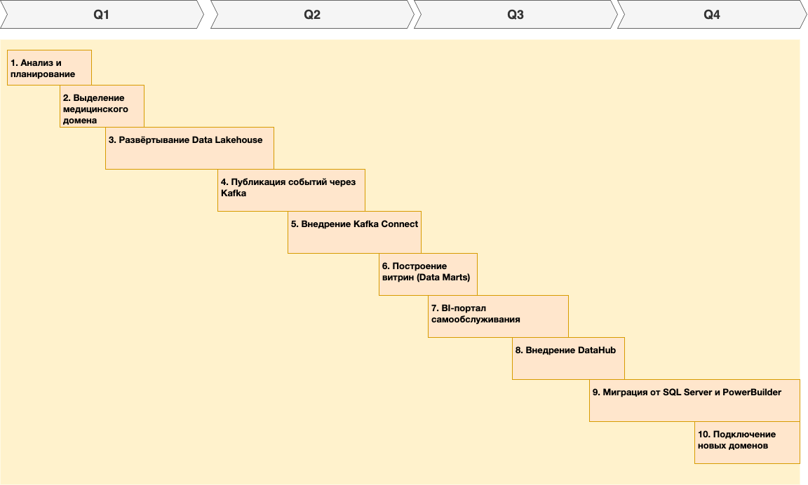

## 1. Технический радар компании «Будущее 2.0»

*Объяснение уровней*

| Уровень    | Что означает                        |
| ---------- | ----------------------------------- |
| **Adopt**  | Активно внедряется и поддерживается |
| **Trial**  | Пилотируется, частично внедрено     |
| **Assess** | Изучается, в перспективе            |
| **Hold**   | Используется в легаси / выводится   |

| Категория            | Технология / Методология   | Статус    | Комментарий                                              |
| -------------------- | -------------------------- | --------- | -------------------------------------------------------- |
| **Data Platforms**   | Microsoft SQL Server 2008  | **Hold**  | Устаревшее хранилище, отказ в перспективе                |
|                      | Apache Iceberg             | **Adopt** | Слой метаданных в Data Lakehouse                         |
|                      | ClickHouse                 | **Adopt** | Быстрое хранилище для витрин                             |
|                      | MinIO / S3                 | **Adopt** | Объектное хранилище для сырых и очищенных данных         |
|                      | DataHub (LinkedIn)         | **Trial** | Каталог данных, lineage, роли                            |
|                      | Tableau                    | **Adopt** | BI-портал самообслуживания                               |
|                      | Power BI                   | **Hold**  | Используется, но не масштабируется под новую архитектуру |
|                      | PowerBuilder               | **Hold**  | Устаревший UI, только для легаси-зоны                    |
| **Data Integration** | Apache Kafka               | **Adopt** | Единый обмен событиями между доменами                    |
|                      | Kafka Connect (S3 Sink)    | **Adopt** | Потокавая передача данных между Kafka и хранилищем       |
|                      | Apache Camel               | **Hold**  | Устаревшая шина, подлежит замене                         |
|                      | API Gateway (Kong)         | **Adopt** | Унифицированный доступ к сервисам                        |
| **AI / ML**          | Python + FastAPI           | **Adopt** | ИИ-сервисы и API                                         |
|                      | JupyterHub                 | **Trial** | Среда анализа для дата-сайентистов                       |
| **Infrastructure**   | Kubernetes / Docker        | **Adopt** | Платформа для сервисов, Kafka, BI и т.д.                 |
|                      | Terraform / Helm           | **Trial** | Инфраструктура как код                                   |
|                      | Prometheus / Grafana       | **Trial** | Мониторинг потоков, загрузки и отказов                   |
| **Methodology**      | Data Mesh                  | **Adopt** | Распределённая ответственность за данные по доменам      |
|                      | Domain-Driven Design (DDD) | **Adopt** | Архитектурная основа разделения по зонам                 |
|                      | Event-Driven Architecture  | **Adopt** | Kafka, pub/sub модель между доменами                     |
|                      | ELT вместо ETL             | **Adopt** | Минимум логики на ingest-этапе, максимум в витринах      |
|                      | GDPR / HIPAA compliance    | **Adopt** | Изоляция медицинских данных                              |

## 2.Технологический роадмап компании «Будущее 2.0»

| Этап                                                  | Срок        | Цель / Изменения                                                           | Ожидаемый результат                                                           | Ответственные команды                   | Ресурсы                                         |
| ----------------------------------------------------- | ----------- | -------------------------------------------------------------------------- | ----------------------------------------------------------------------------- | --------------------------------------- | ----------------------------------------------- |
| **1. Анализ и планирование**                          | Месяц 1     | Разделение системы на домены. Аудит DWH, данных и потоков        | Чёткое понимание границ доменов, источников данных и чувствительных элементов | Архитектура, Data Governance, Аналитика | Архитекторы, бизнес-аналитики, инженеры данных  |
| **2. Выделение медицинского домена**                  | Месяц 1–2   | Изоляция мед. карт и ИИ-диагностик. Отключение этих данных от BI | Безопасное хранение и ограничение доступа к мед. данным                       | Команда DWH, ИИ-команда, ИБ             | Политики доступа, аудит, настройка прав         |
| **3. Развёртывание Data Lakehouse**                   | Месяц 2–4   | Внедрение object storage (S3/MinIO) + Apache Iceberg                    | Гибкая, масштабируемая платформа для хранения сырых и очищенных данных        | DevOps, Инженеры данных                 | Объём хранилища, Kubernetes, Iceberg, Terraform |
| **4. Публикация событий через Kafka**                 | Месяц 3–5   | Настройка потоков событий (финансы, ERP, HR)                            | Потоковое получение данных без привязки к DWH                                 | Интеграционная команда, Финтех, HQ      | Kafka, схемы Avro/JSON, ACL                     |
| **5. Внедрение Kafka Connect**                              | Месяц 4–5   | Настройка потоков Kafka → Object Storage                                | Автоматическая передача событий в lake                                        | Инженеры данных                         | Kafka Connect, S3 endpoint, scheduler                 |
| **6. Построение витрин (Data Marts)**                 | Месяц 5–7   | Создание витрин на ClickHouse по доменам                                | Витрины для BI, без мед. данных                                               | Команды доменов, Data Engineers         | ClickHouse, SQL/DBT, права доступа              |
| **7. BI-портал самообслуживания**                     | Месяц 6–8   | Tableau с подключением к витринам                            | Пользователи строят отчёты без запроса к ИТ                                   | BI-команда, Архитектура                 | Tableau Server, роль BI-кураторов               |
| **8. Внедрение DataHub**                              | Месяц 7–9   | Каталог всех безопасных источников и lineage                            | Повышение прозрачности и контроля качества данных                             | Data Governance, DevOps                 | DataHub, Elastic, Kafka               |
| **9. Миграция от SQL Server и PowerBuilder**          | Месяц 8–12  | Постепенный отказ от DWH как единого центра                             | DWH остаётся только в мед. домене                                             | Команда DWH, клиники, DevOps            | План миграции, архивирование, SLA               |
| **10. Подключение новых доменов (фарма, устройства)** | Месяц 10–12 | Добавление новых потоков событий и витрин                               | Новые бизнесы интегрированы без модификации DWH                               | Архитектура, Бизнес-группы              | Kafka topics, BI-права, метаданные              |

## 📌 Пояснения к этапам

### Этап 1. Анализ и планирование (разделение на домены)
- **Зачем**: устранить хаос и централизацию логики в DWH.
- **Проблема, которую решает**: невозможность независимо развивать разные части бизнеса.
- **Что даёт**: чёткая архитектура, ответственность за данные, подготовка к Data Mesh.

---

### Этап 2. Выделение медицинского домена (изоляция медицинских данных)
- **Зачем**: исключить мед. данные из BI и аналитики.
- **Проблема**: риск утечек, нарушение регуляций (GDPR, HIPAA).
- **Что даёт**: соблюдение нормативов, безопасность, защита ИИ-процессов.

---

### Этап 3. Развёртывание Data Lakehouse
- **Зачем**: перейти от перегруженного DWH к масштабируемому хранилищу.
- **Проблема**: DWH тормозит всё, нельзя гибко расширяться.
- **Что даёт**: низкая стоимость хранения, раздельная обработка данных и логики.

---

### Этап 4. Публикация событий через Kafka
- **Зачем**: получать данные потоками, а не выгрузками.
- **Проблема**: невозможность near real-time отчётности.
- **Что даёт**: событие = изменение, не нужно ждать ночных выгрузок.

---

### Этап 5. Внедрение Kafka Connect
- **Зачем**: стабильный и прозрачный перенос из Kafka в хранилище.
- **Проблема**: хранение не поступает сразу → теряются события.
- **Что даёт**: автоматический и повторноисполняемый поток.

---

### Этап 6. Витрины (Data Marts)
- **Зачем**: ускорить отчёты, отделить аналитику от сырых данных.
- **Проблема**: отчёты в DWH медленные и нестабильные.
- **Что даёт**: быстрая агрегация, оптимизированные таблицы для BI.

---

### Этап 7. BI-портал
- **Зачем**: дать аналитикам и бизнесу самостоятельный доступ.
- **Проблема**: всё через ИТ, запросы ждут неделями.
- **Что даёт**: self-service, доступ по ролям, рост эффективности.

---

### Этап 8. Внедрение DataHub
- **Зачем**: понять, откуда и куда идут данные, кто за что отвечает.
- **Проблема**: неясно, какие таблицы актуальны, кто их поддерживает.
- **Что даёт**: каталог, lineage, governance.

---

### Этап 9. Миграция от SQL Server и PowerBuilder
- **Зачем**: завершить трансформацию, оставить DWH только в медзоне.
- **Проблема**: пока DWH в центре, прогресс ограничен.
- **Что даёт**: снижение нагрузки, полная доменная архитектура.

---

### Этап 10. Подключение новых бизнесов
- **Зачем**: быстро масштабироваться (фарма, электроника).
- **Проблема**: сейчас новое = переписать DWH.
- **Что даёт**: Kafka + витрины → интеграция за недели, а не месяцы.

---

## Конечная цель

К концу года компания получит:
- 💡 BI самообслуживание без участия DWH
- 🔐 Безопасную зону хранения мед. данных
- 🧩 Гибкую архитектуру по доменам
- 📚 Полную прозрачность по данным через DataHub
- 🔄 Готовность к росту и новым бизнесам

